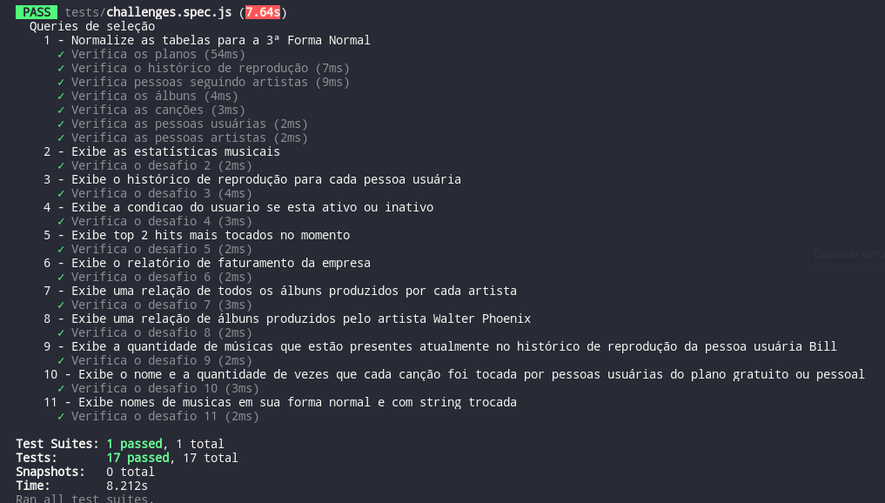

## Author

- [@Ply3r](https://github.com/Ply3r) -- Leandro Henrique


## Contribuitors
- [@xafixav](https://github.com/xafixav) -- Gustavo Andrade


# One for All script

Este projeto foi criado com o intuito de ajudar a popular a tabela do projeto one-for-all da Trybe.


## Deployment

O script espera que sua normalização siga esse formato:


|plano  |   Usuario     | artista |     album      |      cancao      | seguindo_artistas|  usuario_cancao  |
|-------|---------------|---------|----------------|------------------|------------------|------------------|
| plano |    usuario    | artista |     album      |      cancao      |    usuario_id    |    usuario_id    |
| valor |     idade     |         |   artista_id   |    artista_id    |    artista_id    |    cancao_id     |
|       |    plano_id   |         | ano_lancamento | duracao_segundos |                  |  data_reproducao |
|       |data_assinatura|         |                |                  |                  |                  |


> **Caso sua normalização da tabela esteja nos conformes do script:**

Como utilizar:

* Primeiro edite o arquivo **./models/connections.js**

```js script
const connection = mysql.createPool({
  host: 'localhost',
  user: 'root',
  password: 'SUA_SENHA_SE_EXISTIR',
  database: 'SpotifyClone'
});
```

* Abra o **terminal** e rode o seguinte comando:

```bash
  node index.js
```

> Em caso de sucesso a seguinte mensagem ira aparecer *Insert completed*


